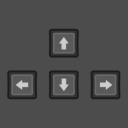
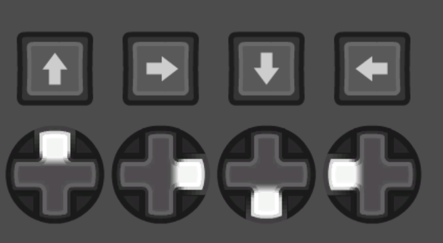
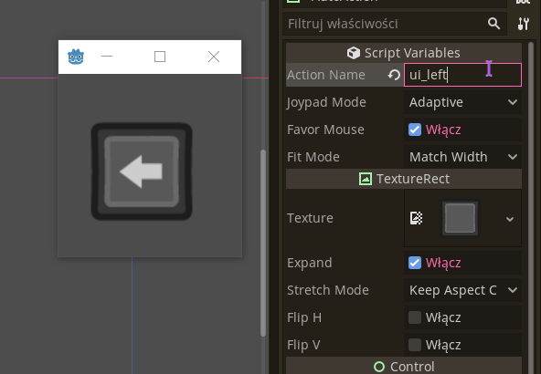
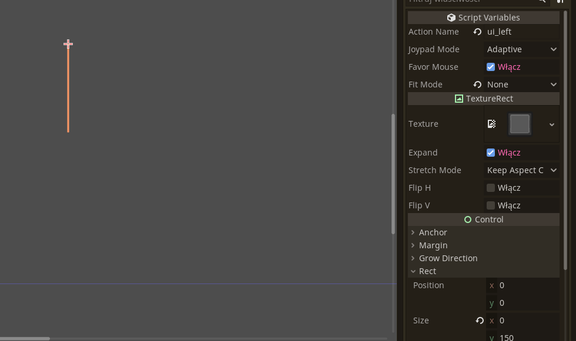
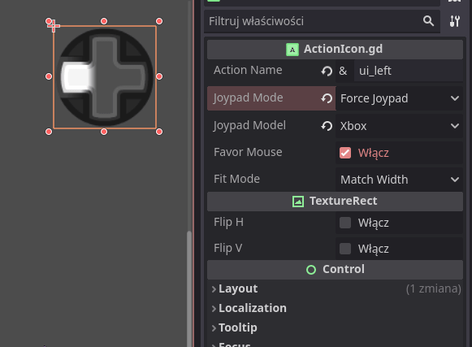

#  Godot Action Icon

Action Icon is a TextureRect-based custom GUI node that you can put on a scene and it will display the associated action. Just activate the plugin and add ActionIcon to your scene. Note that in-editor preview is limited.

It has a couple of display modes to configure:

- Action Name: the name of the action from project's Input Map
- Joypad Mode: whether the action should display keyboard key or joypad button. If set to "Adaptive", the icon will automatically change when it detects keyboard or joypad input. Only relevant to actions that have both assigned.

You can define a custom action, by going to `ActionIcon.gd` script and editing the `CUSTOM_ACTIONS` constant. By default there is a "move" action that displays WSAD/Left Stick. Some device sets include extra buttons that can be used for custom actions.

- Joypad Model: model of the joypad to display. Supported are: Xbox, Xbox360, DualShock 3, DualShock 4, DualSense, Joy-Con. If set to Auto, the script will try to auto-detect the controller based on the device id of joypad events and joy name returned by Godot. "Any Device" option will default to the first joypad. Fallbacks to Xbox if detection fails. All auto-model icons are refreshed when new device is connected, so icons will auto-update if joypad changes.
- Favor Mouse: if an action has a keyboard and mouse button configured, `favor_mouse` set to true will display the mouse button
- Fit Mode: Node = the icon will use whatever size you set. Match Width = the icon minimum width will match its height. Useful e.g. inside HBoxContainer. Match Height = same, but matches height to width. This property internally uses the built-in functionality of TextureRect. You can set it to Custom to set `expand_mode` and `stretch_mode` yourself.

NEW in 1.5: The icon show properly in the editor too.

If you change your input mappings in-game, you can use `get_tree().call_group(&"action_icons", &"refresh")` to refresh all visible icons to match the newly assigned input.

You can customize the appearance of buttons by going to 'addons/ActionIcon` and relevant button folders. By default the Action Icon comes with keyboad, mouse and joypad buttons from [xelu's CC0 input icons pack](https://opengameart.org/content/free-keyboard-and-controllers-prompts-pack).

___
You can find all my addons on my [profile page](https://github.com/KoBeWi).

