# 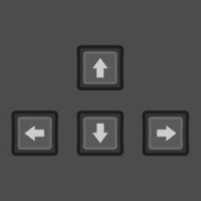 Godot Action Icon

Action Icon is a TextureRect-based custom GUI node that you can put on a scene and it will display the associated action. Just activate the plugin and add ActionIcon to your scene.

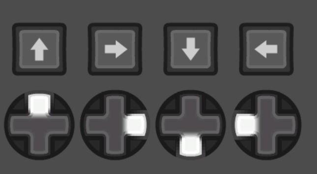

## Usage

The node has a couple of display modes to configure:

- Action Name: The name of the action from project's Input Map, or registered un CustomActions script (see below).
- Joypad Mode: Whether the action should display keyboard key or joypad button. If set to "Adaptive", the icon will automatically change when it detects keyboard or joypad input. Only relevant to actions that have both assigned.

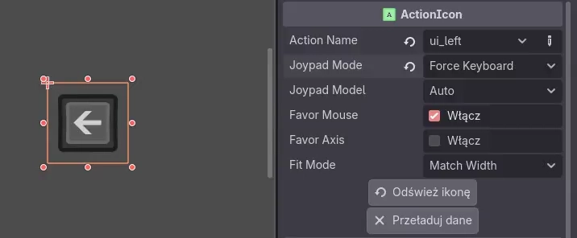

- Joypad Model: model of the joypad to display. If set to "Auto", the script will try to auto-detect the controller based on the device id of joypad events and joy name returned by Godot. "Any Device" option will default to the first joypad. Fallbacks to the default joypad in the icon set if detection fails. All auto-model icons are refreshed when new device is connected, so icons will auto-update if joypad changes.
- Favor Mouse: if an action has a keyboard and mouse button configured, `favor_mouse` makes it display the mouse button.
- Favor Axis: if an action has a joypad button and joypad axis configured (usually d-pad + stick), `favor_axis` makes it display the axis icon.
- Fit Mode: Custom = The icon will use whatever size you set. Match Width = The icon minimum width will match its height. Useful e.g. inside HBoxContainer. Match Height = Same, but matches height to width. This property internally uses the built-in functionality of TextureRect. You can set it to Custom to set `expand_mode` and `stretch_mode` yourself.

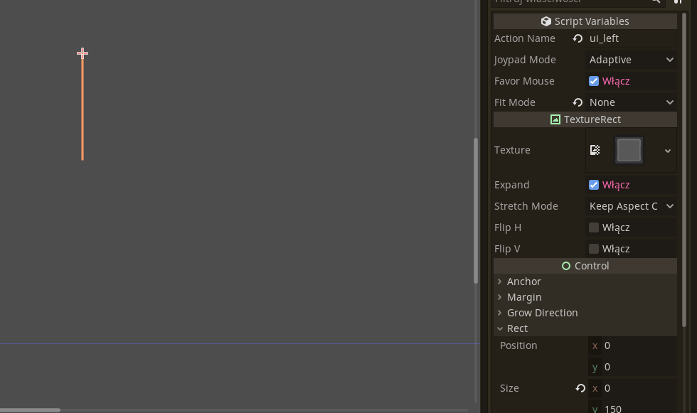

If you change your input mappings in-game, you can use `ActionIcon.refresh_all()` to refresh all visible icons to match the newly assigned input, or `action_icon.refresh()` to refresh the icon. In editor, you can refresh the icon using Refresh Icon inspector button.

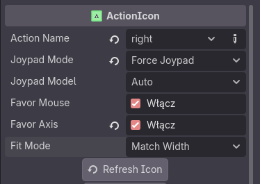

### Project Settings

ActionIcon comes with 2 project settigs, located under `Addons/Action Icon`:
- Action Set Directory: The directory of the action set (see below). If the folder does not exist, a default set is used.
- Automatically Load Icons: If enabled (default), ActionIcon will load all its texture data on project launch. If it affects your startup time or you just want to control when the icons are loaded, disable this settings and call `initialize_data()` static method in ActionIcon.

## Icon Sets

The dispalyed icons are sourced in icon sets. The addon comes with a default set that consists of keyboard/mouse buttons and joypad buttons for XBox Series/Xbox 360, Dual-Shock 3/4 and Joy-Con. The icons are based on [xelu's CC0 input prompt pack](https://thoseawesomeguys.com/prompts/).

### Icon Set Generator

You can easily create your own icon sets with the generator supplied with the addon. You can open the generator dialog with Project > Tools > ActionIcon: Generate Icon Set, or using the Command Palette.

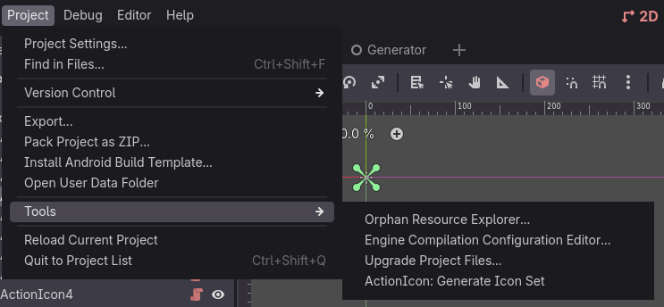

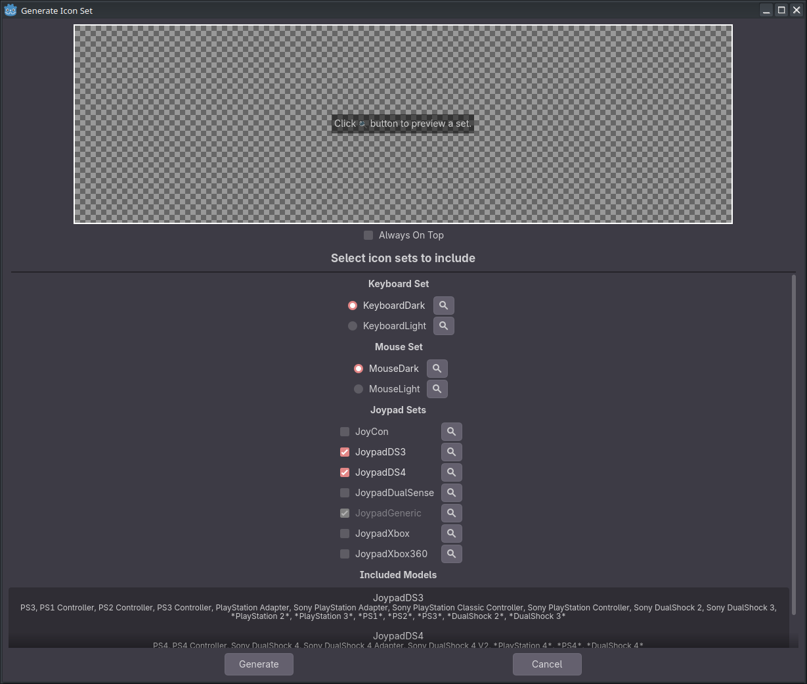

The dialog allows you to customize what icons are included in the set. An icon set consists of keyboard set, mouse set and multiple joypad sets. You can click the 🔍 button next to each set to preview it.

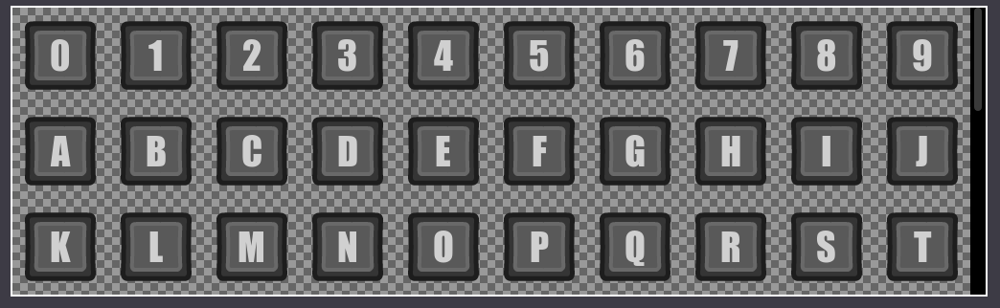

When you click Generate, the generator will create a full set of icons consisting of multiple spritesheets, and put it in the directory specified by the project setting mentioned before. A corresponding mapping file (with `.dat` extension), which maps keycodes/button IDs to an index in the spritesheet, is created for each set. If an input event can't match any mapped ID, it will display a dummy image.

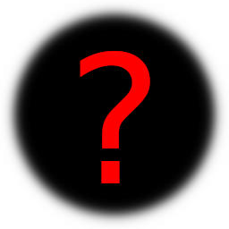

> [!NOTE]
> Generating an icon set only _creates_ files. If your tried different icons and your folder has leftovers, you'll have to delete them manually. They have no effect on ActionIcon, but you will have unused images in your project.

The generated set will not immediately display in the editor. You need to press Reload Data buton in the inspector of ActionIcon to reload all icon data.

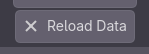

### Creating Custom Sets

You can create custom keyboard, mouse and joypad sets by supplying your own images or customizing the existing sets. The icons are generated dynamically, e.g. keyboard sets are created from a few blank icons with text over them, where font size, color etc. can be customized.

The base icons from which the sets are generated, are called bluerpints. They are located in `ActionIcon/Generator/Blueprints` directory. Multiple blueprints are included with the addon. Each blueprint consists of multiple images and a config file called `Mapping.cfg`. The generator dialog lists the contents of the blueprint directory, so any new blueprints should be located there.

A mapping file is a ConfigFile that consists of multiple sections. The main section is `[info]` section, which includes blueprint type and some settings. For example:
```ini
[info]
type = "keyboard"
font = "Font.tres"
font_color = "d0d0d0"
font_size = 40
```

The other sections depend on the type of the blueprint. All sections except config support copying. You can for example do:
```ini
[keys]
copy = "KeyboardDark"
```
And the keys section will be copied from a blueprint called KeyboardDark. This way you can easily create multiple blueprints using the same configuration. The `copy` directive works recursively. Any key that already exists in the section will not be copied.

The easiest way to create a blueprint is copying an existing one and replacing images/mapping. The generator can preview blueprint changes in real time (you need to focus the window to update).

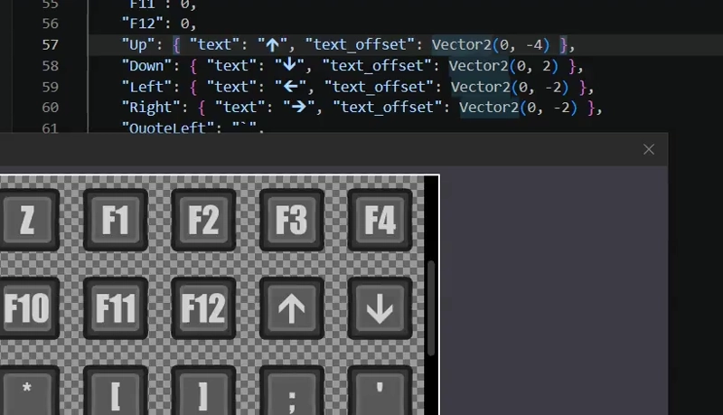

Aside from blueprints, the icon set has its own config, which is the `Config.cfg` file in the blueprints directory. It contains:
- `base_size`: The base size for all icons. Ideally it should match the image sizes. They can be stretched, but it may not look good.
- `default_joypad`: The fallback joypad set to use if the device doesn't match any registered set.

#### Keyboard Blueprints

Keyboard blueprints are generated from images + text. The config consists of:
- `font`: The Font resource used by this set. The value should be a path to that file, relative from the set directory.
- `font_color`: Default font color for keys' text. It needs to be either color name or an rgb hex string.
- `font_size`: Default font size for the icons.

They only have one section: `keys`. The keys of this section are names of the base textures, with value being a dictionary that defines keycodes and their appearance.

Example:
```ini
[keys]
Normal.png = {
	"A": 0,
	"Kp Multiply": "*",
	"Up": { "text": "🡱", "text_offset": Vector2(0, -4) },
	"Windows": { "image": "Windows.png" },
}
```
The keys of the dictionary need to be keycode names (you can refer to `KEY_*` constants in Godot's documentation). The values define how the key icon is created.
- 0 means the key will appear as is, i.e. it will use default font, size, color and copy the keycode text.
- String specifies what text will display. In the above example, the Numpad Multiply key will show as `*`.
- Dictionary allows for more advanced customization. It supports multiple key/values:
    - `text`: The text displayed in the icon.
    - `text_offset`: The offset of the text. By default the text is centered.
    - `font`: Custom font for this icon.
    - `font_color`: Custom font color for this icon.
    - `font_size`: Custom font size for this icon.
    - `image`: Image displayed in this icon. The value has to be name of the image inside the blueprint's folder.

#### Mouse Blueprints

Keyboard blueprints are generated from 2 mor more layers of images. The config consists of:
- `base_image`: The image that shows in every icon as a background (a mouse with no highlights).

There are 2 sections: `buttons` and `wheel`. Button section maps mouse buttons to specific images.
```ini
[buttons]
left = "Left.png"
right = "Right.png"
middle = "Middle.png"
```
The key is name of the button. The value is name of the image in the set's directory that will be displayed over the base image. The following buttons are supported: `left`, `right`, `middle`, `extra1`, `extra2`.

The wheel section maps mouse wheel actions.
```ini
[wheel]
up = "WheelUp.png"
down = "WheelDown.png"
right = "WheelRight.png"
left = "WheelLeft.png"
```
They are displayed as a second image over the middle button's image.

#### Joypad Blueprints

Joypad blueprints mostly consist from since images, since every joypad button has unique design. The config consists of:
- `models`: An array of joypad models to match this set. The model is obtained via `Input.get_joy_name()` and whatever is returned is used to display the best-matched model.

There ara again 2 sections: `buttons` and `directions`. The buttons section lists all non-directional joypad buttons, including triggers (which internally are axes).
```ini
[buttons]
A = "A.png"
B = "B.png"
X = "X.png"
Y = "Y.png"
```
The key is name of the button, based on Godot's `JOY_BUTTON_*` constants. The value is name of the image in the set's directory. The following buttons are supported: `A`, `B`, `X`, `Y`, `L1`, `L2`, `L3`, `R1`, `R2`, `R3`, `Back`, `Start`, `Guide`, `Misc1`-`Misc6`, `Paddle1`-`Paddle4`, `Touchpad`. L1 and R1 are shoulder buttons, L2 and R2 are triggers, L3 and R3 are stick buttons.

Directions are mapped to d-pad and stick axes.
```ini
[directions]
DPad = { "base": "DPad.png", "direction": "DPadDirection.png" }
LeftStick = { "base": "LeftStick.png", "direction": "StickDirection.png" }
RightStick = { "base": "RightStick.png", "direction": "StickDirection.png" }
```
The key is the name of the direction, the value is a dictionary that should include `base` image and `direction` image. The direction image is layered on top of the base image and rotated in four directions to create an icon for each direction. Note that the direction image must be facing to the right.

#### Custom Icons

Aside from the default icons that map to Godot's various input constants, you can define custom icons mapped to a string name. To do so, add a `[custom]` section to your mapping file. The structure is the same for each device.
```ini
[custom]
LeftStick = { "base": "LeftStick.png" }
```
The above example creates an icon named "LeftStick" that displays a non-directional image of a joypad stick. Custom icons can be displayed using custom actions (see below).

The key is the name of the icon (which will be used to find it), the value is a dictionary that defines the icon. The supported fields are:
- `base`: The base texture of the icon. It's stretched to the icon's size (if it's different) and can't be transformed.
- `text`: Adds a text to the icon, like for keyboard keys. The text can be further customized, using the same format as keyboard mapping:
    - `text_offset`: Offset of the string in pixels (it's centered by default).
    - `font`: Font of the text. Note that custom icons defined in keyboard set will not use the default font settings. You'll need to always provide them. If no font customization is provided, the icon will be created with the default theme.
    - `font_color`: Color of the text.
    - `font_size`: Size of the text.
- `overlay`: A texture displayed on top. An icon can use any number of the overlays; any key starting with "overlay" will be considered one (e.g. `overlay1`, `overlay2`, `overlayXD` etc.). They have to be unique and are layered in the order they are defined (with the last one displayed on top). The value for overlay can be either String, which makes a plain image, or a Dictionary, which requires 2 keys:
    `image`: The image file.
    `rotation`: The rotation of the image. `0` is facing right, `1` is `PI / 2`, `3` is `PI` and `4` is `3/4 PI`, so it's in 90 degree increments.

### Custom Actions

Custom actions are actions that don't exist in the InputMap. They are mostly intended for actions composed of multiple other actions, e.g. "movement" encompassing each directional input, or "vertical_wheel" being a mouse wheel up or down action.

Custom actions are created via `CustomActions.gd` script located in the icon set directory. The default icon set also comes with such script, which defines a "move" action, which can display a WSAD compound icon.

The script has to extend `ActionIconCustomActions` class and have `@tool` annotation. The basic workflow is:
- Override the `_initialize()` method.
- In that method, call `register_action("custom_action", action_callback)`.
- Define an `action_callback` method. It takes 2 parameters: `action_icon: ActionIcon` and `device: ActionIcon.Device`, and returns `Texture2D`. The `device` is the device the ActionIcon is supposed to display, based on its properties.
- Add an ActionIcon node, set `action_name` to `custom_action`.
- The icon tries to display the custom action, the `action_callback` is called, returning the texture, which is then displayed.

For the callback part, `ActionIcon` class offers a `get_icon()` method, which takes `icon_id` and device type. You can use it to fetch any icon in the set associated with the device. E.g. `get_icon(MOUSE_BUTTON_LEFT, ActionIcon.Device.MOUSE)` will fetch the icon for the left mouse button (if it exists). You can also use the name of a custom icon as `icon_id`, to display previously defined custom icons. You can of course return any texture, including an arbitrary loaded image from somewhere in your project.

#### Dynamic Icons

The custom actions script also offers a way to prepare dynamic icons, i.e. icons that depend on currently defined inputs and can't be a prepared image. For example the aforementioned "move" action, it can be WSAD, it can be arrows, or any four key combination the player will set in the options.

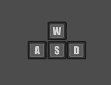

To create dynamic icons, override the `_create_icon_cache()` method. It's called at the beginning and after calling `reload_custom_actions()` static method in ActionIcon. The basic workflow is:
- Call `prepare_icon_bake()`, which returns a SubView node.
- Add any images you want to the viewport.
- Call `bake_icon()` and assign the result to some variable.
- In custom action callback, return the resulting texture.

The viewport has the same size as base icon size of ActionIcon. The dynamic icon is composed of a snapshot of whatever displays in the viewport upon callig `bake_icon()`. The advantage of this helper method is that it's fully synchronous. While the icon will show its content in the next frame, you can use it immediately without awaiting.

### Exporting

When exporting project, the whole ActionIcon/Generator folder can be excluded. The DefaultIconSet can be excluded from export if you use a custom set. Other files are required for the addon to function.

## Localization

The addon supports translations and will automatically use the editor's language, if available. Currently only Polish translation is available. To make a new translation use the Template.pot file found in the addon's folder and feel free to open a pull request.

___
You can find all my addons on my [profile page](https://github.com/KoBeWi).

<a href='https://ko-fi.com/W7W7AD4W4' target='_blank'></a>
