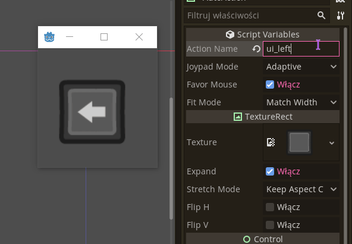
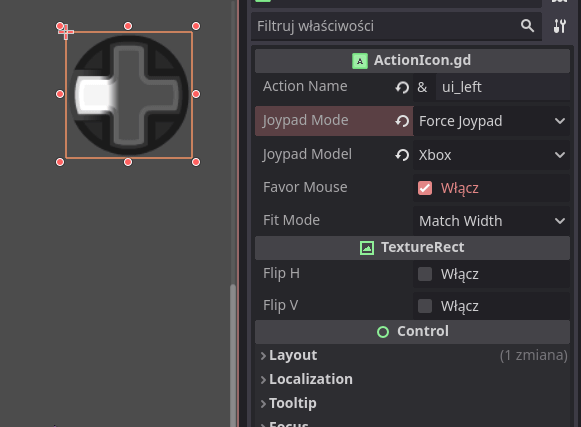

#  Godot Action Icon

Action Icon is a TextureRect-based custom GUI node that you can put on a scene and it will display the associated action. Just activate the plugin and add ActionIcon to your scene.


## Usage

The node has a couple of display modes to configure:

- Action Name: The name of the action from project's Input Map, or registered un CustomActions script (see below).
- Joypad Mode: Whether the action should display keyboard key or joypad button. If set to "Adaptive", the icon will automatically change when it detects keyboard or joypad input. Only relevant to actions that have both assigned.



- Joypad Model: model of the joypad to display. If set to "Auto", the script will try to auto-detect the controller based on the device id of joypad events and joy name returned by Godot. "Any Device" option will default to the first joypad. Fallbacks to the default joypad in the icon set if detection fails. All auto-model icons are refreshed when new device is connected, so icons will auto-update if joypad changes.
- Favor Mouse: if an action has a keyboard and mouse button configured, `favor_mouse` makes it display the mouse button.
- Favor Axis: if an action has a joypad button and joypad axis configured (usually d-pad + stick), `favor_axis` makes it display the axis icon.
- Fit Mode: Custom = The icon will use whatever size you set. Match Width = The icon minimum width will match its height. Useful e.g. inside HBoxContainer. Match Height = Same, but matches height to width. This property internally uses the built-in functionality of TextureRect. You can set it to Custom to set `expand_mode` and `stretch_mode` yourself.


The icon shows properly in the editor too.



If you change your input mappings in-game, you can use `ActionIcon.refresh_all()` to refresh all visible icons to match the newly assigned input, or `action_icon.refresh()` to refresh the icon. In editor, you can refresh the icon using Refresh Icon inspector button.


### Project Settings

ActionIcon comes with 2 project settigs, located under `Addons/Action Icon`:
- Action Set Directory: The directory of the action set (see below). If the folder does not exist, a default set is used.
- Automatically Load Icons: If enabled (default), ActionIcon will load all its texture data on project launch. If it affects your startup time or you just want to control when the icons are loaded, disable this settings and call `initialize_data()` static method in ActionIcon.

## Icon Sets

The dispalyed icons are sourced in icon sets. The addon comes with a default set that consists of keyboard/mouse buttons and joypad buttons for XBox Series/Xbox 360, Dual-Shock 3/4 and Joy-Con. The icons are based on [xelu's CC0 input prompt pack](https://thoseawesomeguys.com/prompts/).

### Icon Set Generator

You can easily create your own icon sets with the generator supplied with the addon. You can open the generator dialog with Project > Tools > ActionIcon: Generate Icon Set, or using the Command Palette.


The dialog allows you to customize what icons are included in the set. An icon set consists of keyboard set, mouse set and multiple joypad sets. You can click the 🔍 button next to each set to preview it.


When you click Generate, the generator will create a full set of icons consisting of multiple spritesheets, and put it in the directory specified by the project setting mentioned before.

> [!NOTE]
> Generating an icon set only _creates_ files. If your tried different icons and your folder has leftovers, you'll have to delete them manually. They have no effect on ActionIcon, but you will have unused images in your project.

### Creating Custom Sets

You can create custom keyboard, mouse and joypad sets by supplying your own images or customizing the existing sets. The icons are generated dynamically, e.g. keyboard sets are created from a few blank icons with text over them, where font size, color etc. can be customized.

The base icons from which the sets are generated, are called bluerpints. They are located in `ActionIcon/Generator/Blueprints` directory. Multiple blueprints are included with the addon. Each blueprint consists of multiple images and a config file called `Mapping.cfg`. The generator dialog lists the contents of the blueprint directory, so any new blueprints should be located there.

A mapping file is a ConfigFile that consists of multiple sections. The main section is `[info]` section, which includes blueprint type and some settings. For example:
```ini
[info]
type = "keyboard"
font = "Font.tres"
font_color = "d0d0d0"
font_size = 40
```

The other sections depend on the type of the blueprint. All sections except config support copying. You can for example do:
```ini
[keys]
copy = "KeyboardDark"
```
And the keys section will be copied from a blueprint called KeyboardDark. This way you can easily create multiple blueprints using the same configuration. The `copy` directive works recursively. Any key that already exists in the section will not be copied.

The easiest way to create a blueprint is copying an existing one and replacing images/mapping. The generator can preview blueprint changes in real time (you need to focus the window to update).


Aside from blueprints, the icon set has its own config, which is the `Config.cfg` file in the blueprints directory. It contains:
- `base_size`: The base size for all icons. Ideally it should match the image sizes. They can be stretched, but it may not look good.
- `default_joypad`: The fallback joypad set to use if the device doesn't match any registered set.

#### Keyboard Blueprints

Keyboard blueprints are generated from images + text. The config consists of:
- `font`: The Font resource used by this set. The value should be a path to that file, relative from the set directory.
- `font_color`: Default font color for keys' text. It needs to be either color name or an rgb hex string.
- `font_size`: Default font size for the icons.

They only have one section: `keys`. The keys of this section are names of the base textures, with value being a dictionary that defines keycodes and their appearance.

Example:
```ini
[keys]
Normal.png = {
	"A": 0,
	"Kp Multiply": "*",
	"Up": { "text": "🡱", "text_offset": Vector2(0, -4) },
	"Windows": { "image": "Windows.png" },
}
```
The keys of the dictionary need to be keycode names (you can refer to `KEY_*` constants in Godot's documentation). The values define how the key icon is created.
- 0 means the key will appear as is, i.e. it will use default font, size, color and copy the keycode text.
- String specifies what text will display. In the above example, the Numpad Multiply key will show as `*`.
- Dictionary allows for more advanced customization. It supports multiple key/values:
    - `text`: The text displayed in the icon.
    - `text_offset`: The offset of the text. By default the text is centered.
    - `font`: Custom font for this icon.
    - `font_color`: Custom font color for this icon.
    - `font_size`: Custom font size for this icon.
    - `image`: Image displayed in this icon. The value has to be name of the image inside the blueprint's folder.

#### Mouse Blueprints


#### Joypad Blueprints

#### Custom Icons

### Custom Actions

### Exporting

When exporting project, the whole ActionIcon/Generator folder can be excluded. The DefaultIconSet can be excluded from export if you use a custom set. Other files are required for the addon to function.

## Localization

The addon supports translations and will automatically use the editor's language, if available. Currently only Polish translation is available. To make a new translation use the Template.pot file found in the addon's folder and feel free to open a pull request.

___
You can find all my addons on my [profile page](https://github.com/KoBeWi).

<a href='https://ko-fi.com/W7W7AD4W4' target='_blank'></a>
